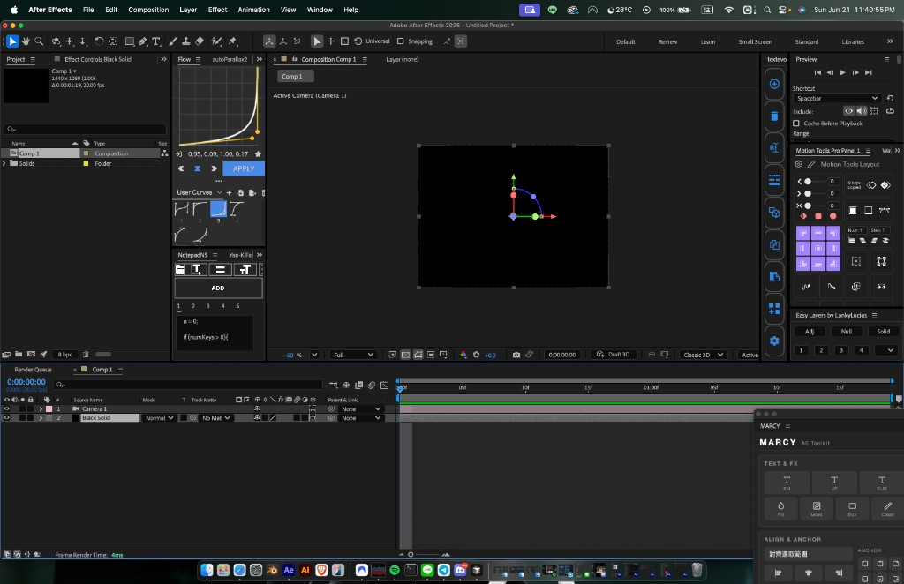
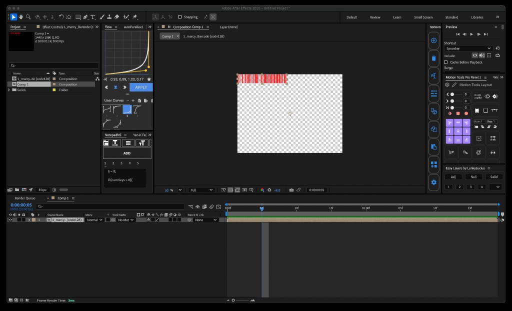

# MARCY — AE Toolkit

After Effects CEP panel for motion-graphics workflow: text presets, effects, align/anchor, layer tools, auto crop, and timeline in/out.

**After Effects 2019–2025+** · macOS / Windows · 繁體中文 UI

<p align="center">
  
</p>

<p align="center">
  
</p>

---

## Download

| Platform | File |
| --- | --- |
| macOS / Windows | [`dist/MARCY.zxp`](dist/MARCY.zxp) (build with `./package-mac.sh`) |

1. Install with [ZXP Installer](https://aescripts.com/learn/zxp-installer/)
2. Restart After Effects
3. Open **Window → Extensions → MARCY**

> Self-signed certificate — if blocked, enable `PlayerDebugMode` (see [Manual](使用說明書_Manual.md)).

---

## Features

| Section | Tools |
| --- | --- |
| **Text & FX** | EN / JP / SUB text presets · Fill · Gradient · Text Box · Clean |
| **Align & Anchor** | Align to selection or comp · Distribute H/V · 3×3 anchor grid · Paragraph L/C/R |
| **Tools** | Pre-comp · Null · Adj · Sep XY · Solid · Camera · Light · Auto Crop · In `[` / Out `]` |

### Options (Tools row)

- **Color** — layer label color for Null / Adj / Solid
- **Qty** — number of layers (nested Null chain count)
- **分別預合成** — pre-compose each selected layer separately
- **單一/合併** — one Null/Adj/Solid for all selected layers, or one per layer

---

## Screenshots

### Camera & Null (3D-safe parenting)

<p align="center">
  
</p>

### Auto Crop (precomp — keeps position, centers anchor)

<p align="center">
  
</p>

---

## Documentation

- [使用說明書 / Manual (繁中 + EN)](使用說明書_Manual.md)

---

## Development

```bash
# macOS: symlink for live reload
ln -sfn "$(pwd)" ~/Library/Application\ Support/Adobe/CEP/extensions/com.marcy.aetools
defaults write com.adobe.CSXS.12 PlayerDebugMode 1

# Package signed ZXP (requires tools/ZXPSignCmd from parent repo)
./package-mac.sh
```

---

## Changelog

| Version | Notes |
| --- | --- |
| **1.0.0** | CEP port from ScriptUI `marcy.jsx` · icon UI · 3D anchor · auto crop fix · Null/Cam fixes |

---

<sub>Bundle ID `com.marcy.aetools` · Ported from marcy.jsx by marcy</sub>
