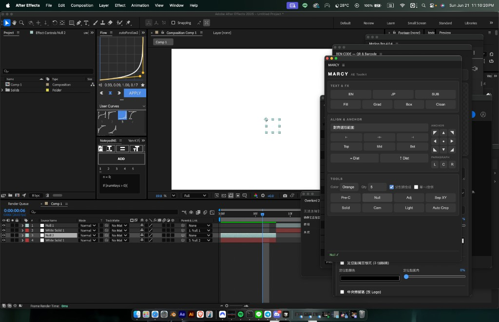

# MARCY AE Toolkit · 使用說明書

> After Effects CEP 面板 — 文字、效果、對齊錨點、圖層工具、Auto Crop、時間軸 In/Out

<p align="center">
  
</p>

---

## 一、這是什麼？

**MARCY** 是從 ScriptUI 面板 `marcy.jsx` 移植而來的 CEP 擴充功能，提供動態設計常用的一鍵工具：建立文字預設、填色/漸層/文字框、對齊與錨點、Null/調整圖層/Solid、攝影機/燈光、Auto Crop、以及 `[` / `]` 時間軸進出點。

---

## 二、系統需求

| 項目 | 需求 |
| --- | --- |
| 軟體 | Adobe After Effects CC 2019 ~ 2025+ |
| 系統 | macOS / Windows |
| 其他 | 無需額外安裝 |

---

## 三、安裝

### 方法 A：ZXP 安裝器（推薦）

1. 安裝 **aescripts ZXP Installer** 或 **Anastasiy's Extension Manager**
2. 將 `dist/MARCY.zxp` 拖入安裝器
3. 重新啟動 After Effects
4. 選單 **Window ▸ Extensions ▸ MARCY**

### 方法 B：開發模式（符號連結）

**macOS**

```bash
defaults write com.adobe.CSXS.12 PlayerDebugMode 1
defaults write com.adobe.CSXS.11 PlayerDebugMode 1

ln -sfn "/path/to/marcy-cep" \
  ~/Library/Application\ Support/Adobe/CEP/extensions/com.marcy.aetools
```

重啟 AE 後從 **Window ▸ Extensions ▸ MARCY** 開啟。

---

## 四、介面說明

### Text & FX

| 按鈕 | 功能 |
| --- | --- |
| **EN** | 建立 Bebas Neue 英文標題文字 |
| **JP** | 建立 VDL Logo Jr 日文範例文字 |
| **SUB** | 建立 Arial 斜體小標 |
| **Fill** | 加入 Fill 效果（白色） |
| **Grad** | 加入 Ramp 漸層 |
| **Box** | 加入 TextBox 2 文字框 |
| **Clean** | 移除 Fill / Ramp / TextBox |

### Align & Anchor

- **對齊選取範圍 / 對齊合成** — 下拉選單決定對齊基準
- **對齊按鈕** — 左 / 水平置中 / 右 / 上 / 垂直置中 / 下
- **Dist** — 水平或垂直等距分佈（至少 3 圖層）
- **Anchor 3×3** — 設定錨點（**3D 圖層同樣可用**，畫面不位移）
- **Paragraph L/C/R** — 文字段落靠左 / 置中 / 靠右

### Tools

| 按鈕 | 功能 |
| --- | --- |
| **Pre-C** | 預合成選取圖層 |
| **Null** | 建立 Null 並 parent 選取圖層 |
| **Adj** | 建立調整圖層 |
| **Sep XY** | 切換 Position 分離 XY |
| **Solid** | 建立黑色 Solid |
| **Cam** | 建立置中攝影機 |
| **Light** | 建立置中燈光 |
| **Crop** | Auto Crop（裁切預合成或作用中合成） |
| **In [** | 進點對齊目前時間（同 AE 快捷鍵 `[`） |
| **Out ]** | 出點對齊目前時間（同 AE 快捷鍵 `]`） |

### 選項列

| 選項 | 說明 |
| --- | --- |
| **Color** | Null / Adj / Solid 的圖層標籤色 |
| **Qty** | 數量（Null 為巢狀層數；Adj/Solid 為疊加數量） |
| **分別預合成** ☑ | 打勾：每個選取圖層各自預合成；取消：合併成一個 |
| **單一/合併** ☑ | 打勾：多選圖層共用一個 Null/Adj/Solid；取消：每圖層各一個 |

---

## 五、使用技巧

### Null 綁定

- **單一/合併 ☑**：多個圖層 → 一組 Null（Qty 決定巢狀層數）
- **單一/合併 ☐**：每個圖層 → 各自一組 Null，排在該圖層上方
- 攝影機 / 燈光 parent 到 Null 時會**保留畫面位置**（不跑位）

### Auto Crop

- 選取**預合成圖層** → 裁切來源合成至內容邊界，**錨點置中、畫面不位移**
- 未選預合成 → 裁切目前作用中的合成

### 3D 錨點

開啟 3D 圖層後，Anchor 九宮格仍可正常使用；會用 `toComp` 補償位置，旋轉/Orientation 下也不會跑位。

---

## 六、打包

```bash
./package-mac.sh
# 產出 dist/MARCY.zxp
```

---

## English summary

**MARCY** is a CEP panel for AE motion-graphics: text presets, FX, align/anchor (3D-safe), layer utilities, auto crop, and timeline in/out shortcuts. Install via ZXP, open from **Window → Extensions → MARCY**. See README for screenshots and dev setup.

---

<sub>Bundle ID: com.marcy.aetools · v1.0.0</sub>
